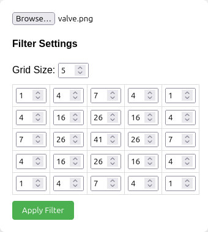

# image-filters-visualization

## Description

This application allows users to upload an image and apply custom convolution filters to it. The user can define the size of the filter grid and the values for each cell in the grid. The application then processes the image using the specified filter and displays the output image.

## How to Use

1. Open the application in a web browser.
2. Upload an image by clicking the "Browse" button above the filter grid and selecting an image file.
3. Adjust the filter grid size by changing the value in the "Grid Size" input box. The default size is 3x3.
4. Enter the desired values for each cell in the filter grid. The center cell is set to 1 by default, and all other cells are set to 0.
5. Click the "Apply Filter" button to process the image with the specified filter.
6. The output image will be displayed on the right side of the screen.

## Examples of Various Filters

Here are some examples of common filters you can try:

### Input Image

### Identity Filter

This filter leaves the image unchanged.

#### Filter

#### Output Image

### Gaussian Blur Filter

This filter applies a Gaussian blur to the image.

#### Filter

#### Output Image

### Laplacian Filter

This is a second-order derivative filter used for edge detection.

#### Filter

#### Output Image

Feel free to experiment with different values to create your own custom filters!

## Future Work

The primary goal for the future is to add the feature for combining different filters together and the ability to apply a stack of filters on top of an image.
